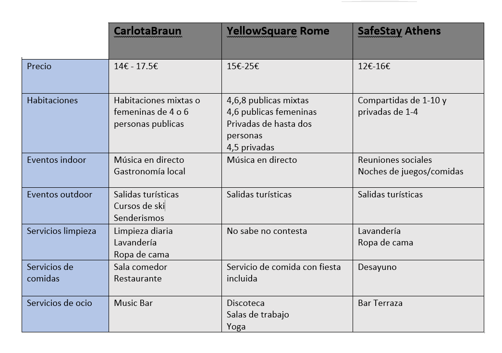
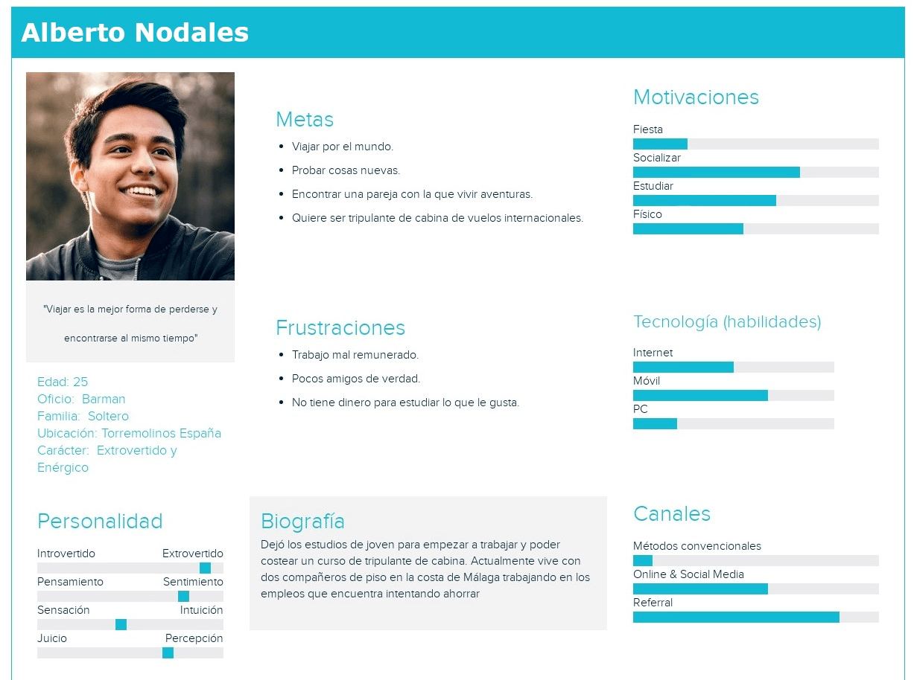
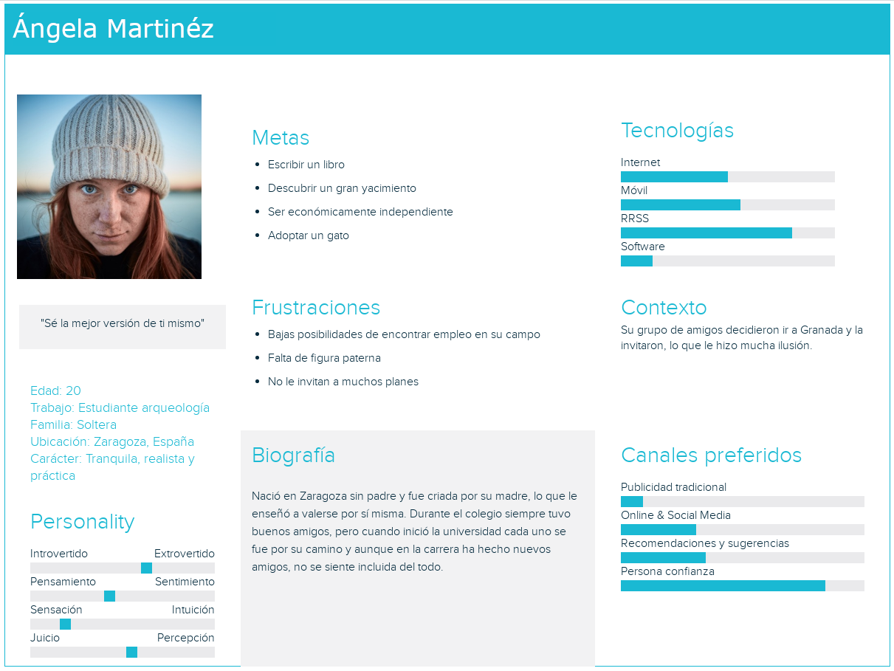
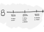
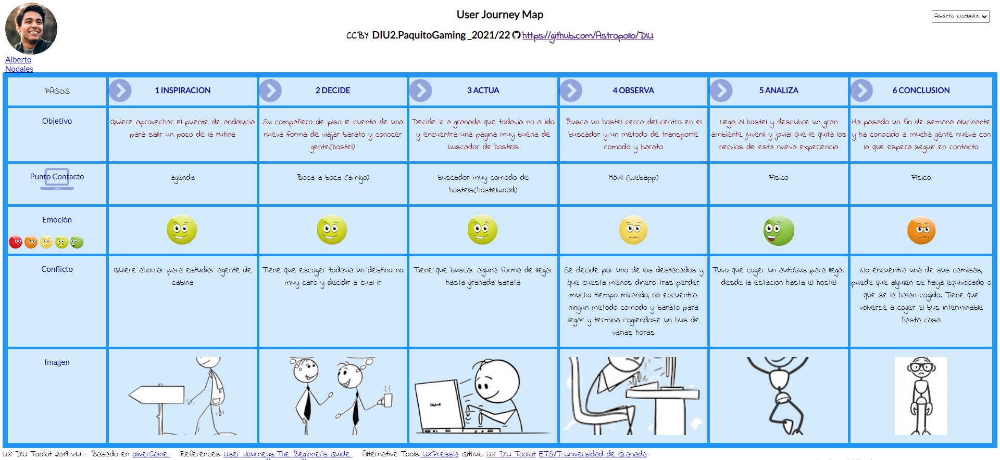
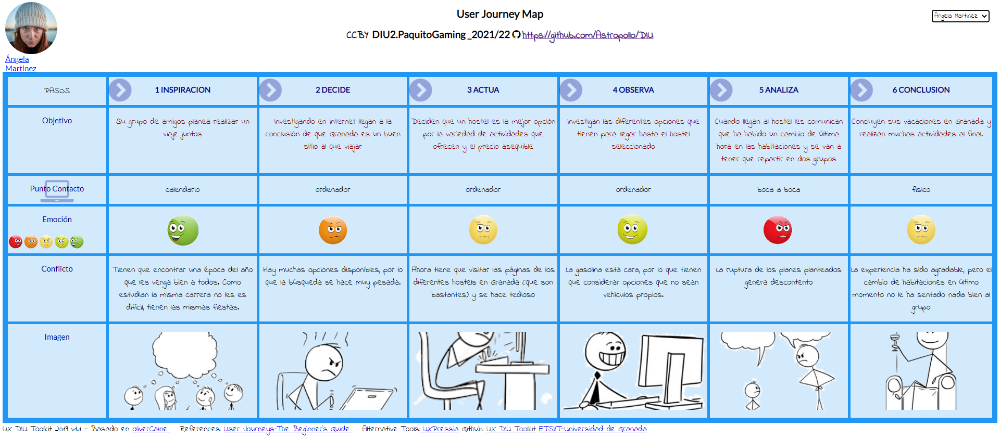
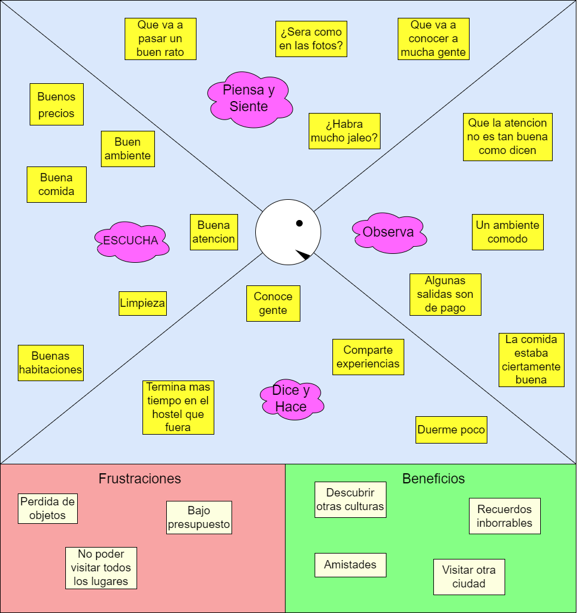
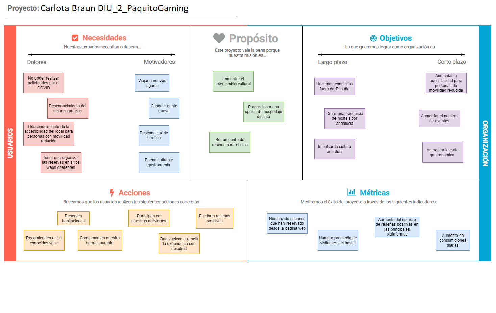
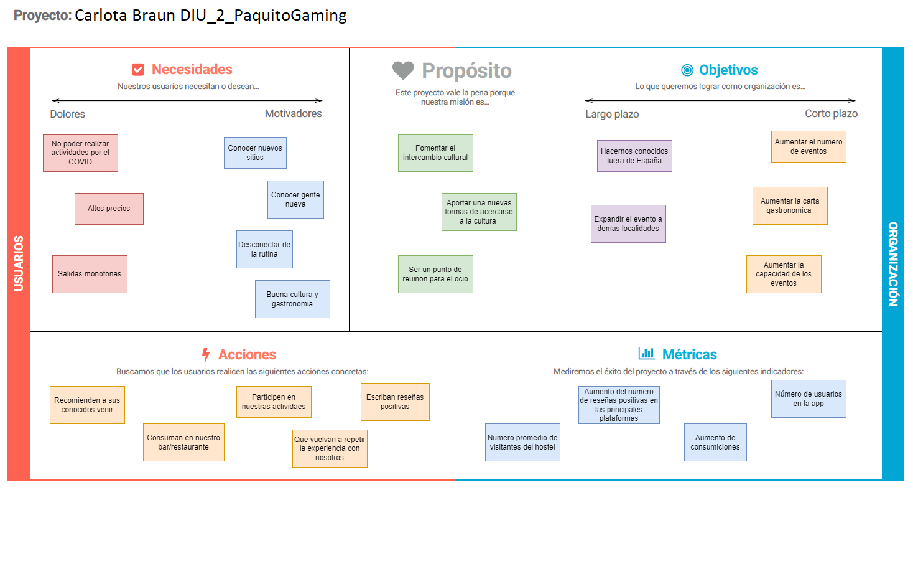

# DIU22
Prácticas Diseño Interfaces de Usuario 2021-22 (Tema: Hostels) 

# DIU22
Prácticas Diseño Interfaces de Usuario 2021-22 (Tema: Hostels) 

Grupo: DIU2_PaquitoGaming.  Curso: 2021/22 
Updated: 20/3/2022

Proyecto: Carlota Braum

Descripción: 

>>> Describa la idea de su producto en la práctica 2 

Logotipo: 
>>> Opcionalmente si diseña un logotipo para su producto en la práctica 3 pongalo aqui

Miembros
 * :bust_in_silhouette:   Óscar López Maldonado    :octocat:     
 * :bust_in_silhouette:  Luis Guerra Batista     :octocat:

----- 

# Proceso de Diseño 

## Paso 1. UX Desk Research & Analisis 

 1.a Competitive Analysis
-----

Se trata de un alojamiento que busca ser un nexo entre el ocio nocturno y la cultura nazarí de granada 
siendo a su vez un lugar cómodo y acogedor los residentes. Esto es debido su variedad de eventos por la ciudad de 
granada y dentro del local con los servicios indoor que proporciona (music-bar, climatización, servicio de lavandería, guarda equipaje, etc.) 
se convierte a su vez en un gran punto de encuentro para cualquiera de la ciudad

 1.b Persona
-----

Hemos escogido dos perfiles bastante comunes en el publico objetivo de este tipo de hospedajes. 
Gente con no muchos problemas a la hora de socializar y mayoritariamente jovenes de entre 20 y 30 años

 1.c User Journey Map
----

Ambos han tenido distintos puntos de vista de las experiencias. Mientras que Ángela buscaba mas tema servicios y demas, 
Alberto iba un poco mas a ver lo que se encontraba y fiandose mas de lo que le habian contado.

1.d Usability Review
----
>>> - Para acceder al documento conla Revision de Usabilidad de la aplicacion, ([pulse aquí](https://github.com/OscarLM32/DIU/blob/master/P1/Usability-review-Carlota-Braun.pdf))
>>> - Valoración final (numérica): 69(good)
----
Los relativamente altos tiempos de cargar de alguna de sus paginas y la falta de ayuda para los usuarios menos experimentados, se ven solventados por una interfaz bastante sencilla e intuitiva que no dejara indiferente a ningun tipo de publico. A su vez, a nivel de marketing, podemos afirmar que esta bastante bien focalizada a su publico objetivo.

## Paso 2. UX Design  

 2.a Feedback Capture Grid / Empathy map / POV
----

>>> Comenta con un diagrama los aspectos más destacados a modo de conclusion de la práctica anterior,

| Interesante                                             |Críticas                                      |
|---------------------------------------------------------|----------------------------------------------|
| La navegacion por la pagina es intuitiva.               | Excesos de cambios de tipografia.            |
| Informacion simple y condensada.                        | Falta de ayuda al usuario.                   |
| El proceso de reserva es rapido.                        | Falta de personalizacion en la busqueda.     |
| Es facil encontrar informacion de como llegar al local. | Mejorar la eficiencia de la pagina.          |
  
|  Preguntas                                           | Nuevas ideas                                                                      |
|------------------------------------------------------|-----------------------------------------------------------------------------------|
| ¿Hay mas ofertas culturales fuera de la pagina web?. | Habilitar una pestaña de ayudas para la reserva de habitaciones.                  |
| ¿Cuál es el menú del restaurante?.                   | Capacidad para guardar el estado de la reserva.                                   |
| ¿Se pueden proponer eventos?.                        | 	Contratar a un ingeniero de servidores para mejorar la respuesta de la pagina. | 
| ¿Hay descuento para grupos?.                         | Ofrecer la posibilidad de escoger habitaciones y fechas a la vez.                 |

    
>>> ¿Que planteas como "propuesta de valor" para un nuevo diseño de aplicación para economia colaborativa ?
>>> Problema e hipótesis
>>>  Que planteas como "propuesta de valor" para un nuevo diseño de aplicación para economia colaborativa te
>>> (150-200 palabras)

 2.b ScopeCanvas

----
>>> Propuesta de valor 

 2.b Tasks analysis 

Grupos: 
    Individuo local
    Individuo extranjero
    Grupo local
    Grupo extranjero

Task:
    Reservar habitacion 
    Reservar en el restaurante
    Ver eventos
    Ver carta
    Solicitar ayuda
    Dejar reseña
    Consultar servicios

||Individuo local|Individuo extranjero|Grupo local|Grupo extranjero|
|----------------|--------------------|------------------|-----------------|----------------|
|Reservar habitacion|L|M|L|H|
|Consultar servicios|L|H|M|H|
|Reservar en el restaurante|L|L|H|M|
|Ver eventos|H|H|M|M|
|Ver carta|L|M|M|H|
|Solicitar ayuda|L|M|M|H|
|Dejar reseña|L|H|L|H|

 2.c IA: Sitemap + Labelling 
----

>>> Identificar términos para diálogo con usuario  

Término | Significado     
| ------------- | -------
  Login¿?  | acceder a plataforma

 2.d Wireframes
-----

>>> Plantear el  diseño del layout para Web/movil (organización y simulación ) 

## Paso 3. Mi UX-Case Study (diseño)

 3.a Moodboard
-----

>>> Plantear Diseño visual con una guía de estilos visual (moodboard) 
>>> Incluir Logotipo
>>> Si diseña un logotipo, explique la herramienta utilizada y la resolución empleada. ¿Puede usar esta imagen como cabecera de Twitter, por ejemplo, o necesita otra?

  3.b Landing Page
----

>>> Plantear Landing Page 

 3.c Guidelines
----

>>> Estudio de Guidelines y Patrones IU a usar 
>>> Tras documentarse, muestre las deciones tomadas sobre Patrones IU a usar para la fase siguiente de prototipado. 

  3.d Mockup
----

>>> Layout: Mockup / prototipo HTML  (que permita simular tareas con estilo de IU seleccionado)

 3.e ¿My UX-Case Study?
-----

>>> Publicar my Case Study en Github..
>>> Documente y resuma el diseño de su producto en forma de video de 90 segundos aprox

## Paso 4. Evaluación 

 4.a Caso asignado
----

>>> Breve descripción del caso asignado con enlace a  su repositorio Github

 4.b User Testing
----

>>> Seleccione 4 personas ficticias. Exprese las ideas de posibles situaciones conflictivas de esa persona en las propuestas evaluadas. Asigne dos a Caso A y 2 al caso B
 

| Usuarios | Sexo/Edad     | Ocupación   |  Exp.TIC    | Personalidad | Plataforma | TestA/B
| ------------- | -------- | ----------- | ----------- | -----------  | ---------- | ----
| User1's name  | H / 18   | Estudiante  | Media       | Introvertido | Web.       | A 
| User2's name  | H / 18   | Estudiante  | Media       | Timido       | Web        | A 
| User3's name  | M / 35   | Abogado     | Baja        | Emocional    | móvil      | B 
| User4's name  | H / 18   | Estudiante  | Media       | Racional     | Web        | B 

. 4.c Cuestionario SUS
----

>>> Usaremos el **Cuestionario SUS** para valorar la satisfacción de cada usuario con el diseño (A/B) realizado. Para ello usamos la [hoja de cálculo](https://github.com/mgea/DIU19/blob/master/Cuestionario%20SUS%20DIU.xlsx) para calcular resultados sigiendo las pautas para usar la escala SUS e interpretar los resultados
http://usabilitygeek.com/how-to-use-the-system-usability-scale-sus-to-evaluate-the-usability-of-your-website/)
Para más información, consultar aquí sobre la [metodología SUS](https://cui.unige.ch/isi/icle-wiki/_media/ipm:test-suschapt.pdf)

>>> Adjuntar captura de imagen con los resultados + Valoración personal 

 4.d Usability Report
----

>> Añadir report de usabilidad para práctica B (la de los compañeros)

>>> Valoración personal 

>>> ## Paso 5. Evaluación de Accesibilidad  (no necesaria)

>>>   5.a Accesibility evaluation Report 
>>>> ----

>>> Indica qué pretendes evaluar (de accesibilidad) sobre qué APP y qué resultados has obtenido 

>>> 5.a) Evaluación de la Accesibilidad (con simuladores o verificación de WACG) 
>>> 5.b) Uso de simuladores de accesibilidad 

>>> (uso de tabla de datos, indicar herramientas usadas) 

>>> 5.c Breve resumen del estudio de accesibilidad (de práctica 1) y puntos fuertes y de mejora de los criterios de accesibilidad de tu diseño propuesto en Práctica 4.

## Conclusión final / Valoración de las prácticas

>>> (90-150 palabras) Opinión del proceso de desarrollo de diseño siguiendo metodología UX y valoración (positiva /negativa) de los resultados obtenidos  

