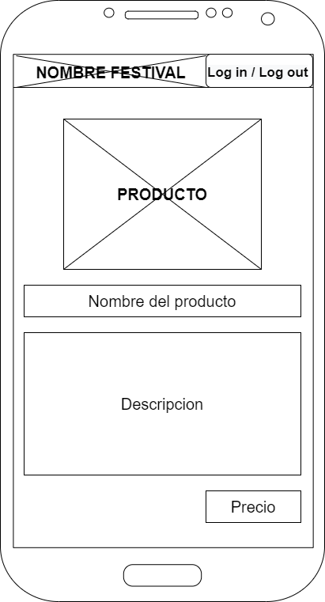

# DIU22
Prácticas Diseño Interfaces de Usuario 2021-22 (Tema: Hostels) 

# DIU22
Prácticas Diseño Interfaces de Usuario 2021-22 (Tema: Hostels) 

Grupo: DIU2_PaquitoGaming.  Curso: 2021/22 
Updated: 20/3/2022

Proyecto: Carlota Braum

Descripción: 

>>> Describa la idea de su producto en la práctica 2 

Logotipo: 
>>> Opcionalmente si diseña un logotipo para su producto en la práctica 3 pongalo aqui

Miembros
 * :bust_in_silhouette:   Óscar López Maldonado    :octocat:     
 * :bust_in_silhouette:  Luis Guerra Batista     :octocat:

----- 

# Proceso de Diseño 

## Paso 1. UX Desk Research & Analisis 

 1.a Competitive Analysis
-----

Se trata de un alojamiento que busca ser un nexo entre el ocio nocturno y la cultura nazarí de granada 
siendo a su vez un lugar cómodo y acogedor los residentes. Esto es debido su variedad de eventos por la ciudad de 
granada y dentro del local con los servicios indoor que proporciona (music-bar, climatización, servicio de lavandería, guarda equipaje, etc.) 
se convierte a su vez en un gran punto de encuentro para cualquiera de la ciudad

 1.b Persona
-----

Hemos escogido dos perfiles bastante comunes en el publico objetivo de este tipo de hospedajes. 
Gente con no muchos problemas a la hora de socializar y mayoritariamente jovenes de entre 20 y 30 años

 1.c User Journey Map
----

Ambos han tenido distintos puntos de vista de las experiencias. Mientras que Ángela buscaba mas tema servicios y demas, 
Alberto iba un poco mas a ver lo que se encontraba y fiandose mas de lo que le habian contado.

1.d Usability Review
----
>>> - Para acceder al documento conla Revision de Usabilidad de la aplicacion, ([pulse aquí](https://github.com/OscarLM32/DIU/blob/master/P1/Usability-review-Carlota-Braun.pdf))
>>> - Valoración final (numérica): 69(good)
----
Los relativamente altos tiempos de cargar de alguna de sus paginas y la falta de ayuda para los usuarios menos experimentados, se ven solventados por una interfaz bastante sencilla e intuitiva que no dejara indiferente a ningun tipo de publico. A su vez, a nivel de marketing, podemos afirmar que esta bastante bien focalizada a su publico objetivo.

## Paso 2. UX Design  

 2.a Feedback Capture Grid y Empathy map 
----
Hemos optado por realizar ambas opciones disponibles: 'capture grid' y 'empathy map'. Esto ha sido  planteado
de esta manera porque en nuestra opinión, estos diagramas/tablas son complementarios uno del otro y juntos
aportan una información mucho más detallada sobre los diferentes problemas que presenta una página web o aplicación.

En primer lugar, el 'capture grid' nos permite obtener el 'feedback' de los usuarios a un nivel muchos más funcional,
cuál es su experiencia haciendo uso de la página y qué otras dudas les han surgido navegando por la misma. Mientras
que por otro lado el 'empathy map' nos ayuda a comprender qué tipo de imagen mental tienen los usuarios sobre la marca. De
esta manera seremos capaces de diseñar nuestro microsite con una estética que se asemeje en la mayor medida a lo que los usuarios imaginan.

| Interesante                                             |Críticas                                      |
|---------------------------------------------------------|----------------------------------------------|
| La navegacion por la pagina es intuitiva.               | Excesos de cambios de tipografia.            |
| Informacion simple y condensada.                        | Falta de ayuda al usuario.                   |
| El proceso de reserva es rapido.                        | Falta de personalizacion en la busqueda.     |
| Es facil encontrar informacion de como llegar al local. | Mejorar la eficiencia de la pagina.          |
  
|  Preguntas                                           | Nuevas ideas                                                                      |
|------------------------------------------------------|-----------------------------------------------------------------------------------|
| ¿Hay mas ofertas culturales fuera de la pagina web?. | Habilitar una pestaña de ayudas para la reserva de habitaciones.                  |
| ¿Cuál es el menú del restaurante?.                   | Capacidad para guardar el estado de la reserva.                                   |
| ¿Se pueden proponer eventos?.                        | 	Contratar a un ingeniero de servidores para mejorar la respuesta de la pagina. | 
| ¿Hay descuento para grupos?.                         | Ofrecer la posibilidad de escoger habitaciones y fechas a la vez.                 |

Es despues de haber analizado todo lo visto previamente que proponemos "Tintito para el Veranito".

Este evento propone una mezcla entre las salas de arcade y un torneo de puntos. La idea es que durante un mes habra eventos en los que las consumisiones en los mismos iran dando puntos para que finalmente canjearlos por productos y clasificar en una especie de ranking del "mas juerguero" para optar al gran premio del evento. Todo esto se llevara a cabo por una aplicacion en la que los que quieran participar se registraran y podran ver los puntos que llevan, los eventos, los premios, el ranking y su propio QR para obtener los puntos

 2.b ScopeCanvas

----

 2.b Tasks analysis 

|                             | 18-22 años | 23-30 años | 30-45 años | 45+ |
|-----------------------------|------------|------------|------------|-----|
| Registrarse                 | H          | M          | L          | L   |
| Log In                      | H          | M          | L          | L   |
| Log Out                     | M          | M          | L          | L   |
| Ver eventos                 | H          | H          | H          | H   |
| Acceder a detalles evento   | M          | M          | H          | H   |
| Dejar reseña                | L          | M          | H          | H   |
| Acceder a ranking de puntos | H          | H          | L          | L   |
| Buscar usuario en ranking   | H          | H          | L          | L   |
| Ver productos canjeables    | H          | M          | M          | L   |
| Obtener QR                  | L          | M          | H          | H   |
| Editar foto perfil          | H          | M          | H          | L   |

 2.c IA: Sitemap + Labelling 
----

 

| Término            | Significado                                                         |  
|--------------------|---------------------------------------------------------------------|
| Log In             | Introducir los datos para usar la aplicación                        |
| Log Out            | Salir de tu sesion en la aplicacion                                 |
| Registrarse        | Introducir tus crecenciales para poder iniciar sesión               |
| Home               | Página principal de la aplicación                                   |
| Puntos             | Divisa de la aplicación                                             |
| Ranking            | Tabla de puntuaciones globales del evento ordenada de mayor a menor |
| Evento             | Acontecimiento social en el que se pueden conseguir puntos          |
| Producto canjeable | Objetos que se pueden comprar con los puntos obtenidos              |
| Código QR          | Imagen escaneable que identifica a un persona                       |
| Email              | Correo electrónico                                                  |
| Foto de perfil     | Imagen que se muestra al resto de usuarios en la aplicación         |

 2.d Wireframes

## Paso 3. Mi UX-Case Study (diseño)

 3.a Moodboard
-----

>>> Plantear Diseño visual con una guía de estilos visual (moodboard) 
>>> Incluir Logotipo
>>> Si diseña un logotipo, explique la herramienta utilizada y la resolución empleada. ¿Puede usar esta imagen como cabecera de Twitter, por ejemplo, o necesita otra?

  3.b Landing Page
----

>>> Plantear Landing Page 

 3.c Guidelines
----

>>> Estudio de Guidelines y Patrones IU a usar 
>>> Tras documentarse, muestre las deciones tomadas sobre Patrones IU a usar para la fase siguiente de prototipado. 

  3.d Mockup
----

>>> Layout: Mockup / prototipo HTML  (que permita simular tareas con estilo de IU seleccionado)

 3.e ¿My UX-Case Study?
-----

>>> Publicar my Case Study en Github..
>>> Documente y resuma el diseño de su producto en forma de video de 90 segundos aprox

## Paso 4. Evaluación 

 4.a Caso asignado
----

>>> Breve descripción del caso asignado con enlace a  su repositorio Github

 4.b User Testing
----

>>> Seleccione 4 personas ficticias. Exprese las ideas de posibles situaciones conflictivas de esa persona en las propuestas evaluadas. Asigne dos a Caso A y 2 al caso B
 

| Usuarios | Sexo/Edad     | Ocupación   |  Exp.TIC    | Personalidad | Plataforma | TestA/B
| ------------- | -------- | ----------- | ----------- | -----------  | ---------- | ----
| User1's name  | H / 18   | Estudiante  | Media       | Introvertido | Web.       | A 
| User2's name  | H / 18   | Estudiante  | Media       | Timido       | Web        | A 
| User3's name  | M / 35   | Abogado     | Baja        | Emocional    | móvil      | B 
| User4's name  | H / 18   | Estudiante  | Media       | Racional     | Web        | B 

. 4.c Cuestionario SUS
----

>>> Usaremos el **Cuestionario SUS** para valorar la satisfacción de cada usuario con el diseño (A/B) realizado. Para ello usamos la [hoja de cálculo](https://github.com/mgea/DIU19/blob/master/Cuestionario%20SUS%20DIU.xlsx) para calcular resultados sigiendo las pautas para usar la escala SUS e interpretar los resultados
http://usabilitygeek.com/how-to-use-the-system-usability-scale-sus-to-evaluate-the-usability-of-your-website/)
Para más información, consultar aquí sobre la [metodología SUS](https://cui.unige.ch/isi/icle-wiki/_media/ipm:test-suschapt.pdf)

>>> Adjuntar captura de imagen con los resultados + Valoración personal 

 4.d Usability Report
----

>> Añadir report de usabilidad para práctica B (la de los compañeros)

>>> Valoración personal 

>>> ## Paso 5. Evaluación de Accesibilidad  (no necesaria)

>>>   5.a Accesibility evaluation Report 
>>>> ----

>>> Indica qué pretendes evaluar (de accesibilidad) sobre qué APP y qué resultados has obtenido 

>>> 5.a) Evaluación de la Accesibilidad (con simuladores o verificación de WACG) 
>>> 5.b) Uso de simuladores de accesibilidad 

>>> (uso de tabla de datos, indicar herramientas usadas) 

>>> 5.c Breve resumen del estudio de accesibilidad (de práctica 1) y puntos fuertes y de mejora de los criterios de accesibilidad de tu diseño propuesto en Práctica 4.

## Conclusión final / Valoración de las prácticas

>>> (90-150 palabras) Opinión del proceso de desarrollo de diseño siguiendo metodología UX y valoración (positiva /negativa) de los resultados obtenidos  

