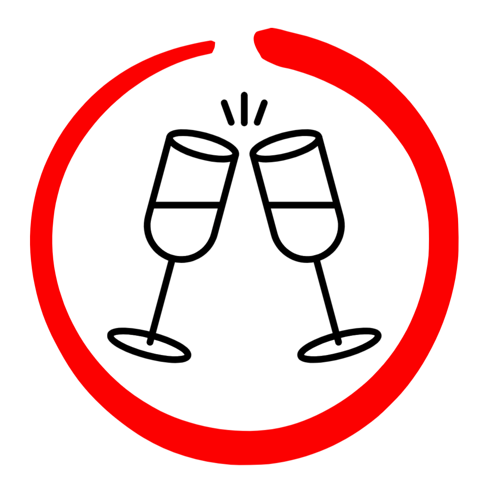
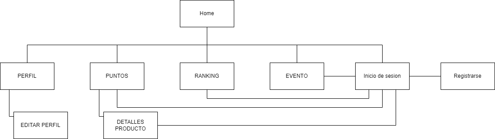
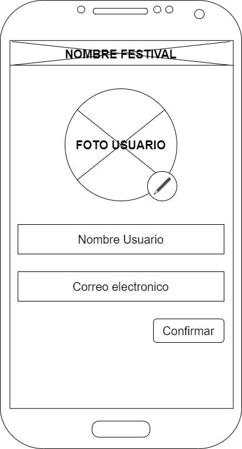
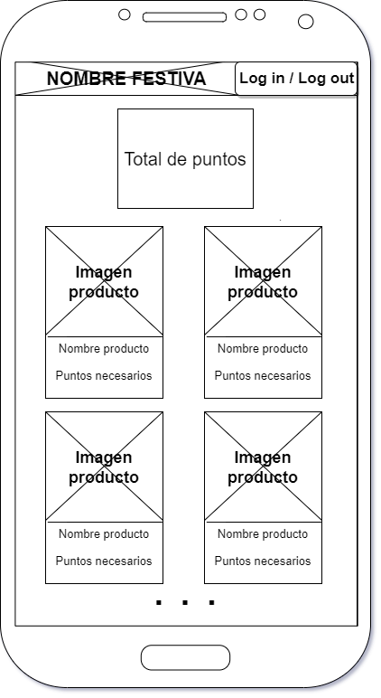
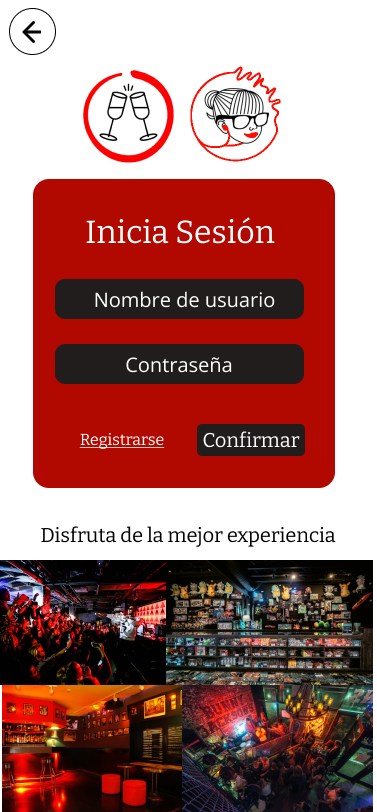

# DIU22
Prácticas Diseño Interfaces de Usuario 2021-22 (Tema: Hostels) 

# DIU22
Prácticas Diseño Interfaces de Usuario 2021-22 (Tema: Hostels) 

Grupo: DIU2_PaquitoGaming.  Curso: 2021/22 
Updated: 20/3/2022

Proyecto: Tintito para el veranito

Descripción: 

Durante el evento de Tintito para el veranito, en cualquier evento que realice Carlota
Braun, los clientes recibirán puntos por consumicion. Estos puntos servirán para canjearlos por
productos cuando se tengan los suficientes.

Logotipo: 

Miembros
 * :bust_in_silhouette:   Óscar López Maldonado    :octocat:     
 * :bust_in_silhouette:  Luis Guerra Batista     :octocat:

----- 

# Proceso de Diseño 

## Paso 1. UX Desk Research & Analisis 

 1.a Competitive Analysis
-----

Se trata de un alojamiento que busca ser un nexo entre el ocio nocturno y la cultura nazarí de granada 
siendo a su vez un lugar cómodo y acogedor los residentes. Esto es debido su variedad de eventos por la ciudad de 
granada y dentro del local con los servicios indoor que proporciona (music-bar, climatización, servicio de lavandería, guarda equipaje, etc.) 
se convierte a su vez en un gran punto de encuentro para cualquiera de la ciudad

 1.b Persona
-----

Hemos escogido dos perfiles bastante comunes en el publico objetivo de este tipo de hospedajes. 
Gente con no muchos problemas a la hora de socializar y mayoritariamente jovenes de entre 20 y 30 años

 1.c User Journey Map
----

Ambos han tenido distintos puntos de vista de las experiencias. Mientras que Ángela buscaba mas tema servicios y demas, 
Alberto iba un poco mas a ver lo que se encontraba y fiandose mas de lo que le habian contado.

1.d Usability Review
----
>>> - Para acceder al documento conla Revision de Usabilidad de la aplicacion, ([pulse aquí](https://github.com/OscarLM32/DIU/blob/master/P1/Usability-review-Carlota-Braun.pdf))
>>> - Valoración final (numérica): 69(good) 
----
Los relativamente altos tiempos de cargar de alguna de sus paginas y la falta de ayuda para los usuarios menos experimentados, se ven solventados por una interfaz bastante sencilla e intuitiva que no dejara indiferente a ningun tipo de publico. A su vez, a nivel de marketing, podemos afirmar que esta bastante bien focalizada a su publico objetivo.

## Paso 2. UX Design  

 2.a Feedback Capture Grid y Empathy map 
----
Hemos optado por realizar ambas opciones disponibles: 'capture grid' y 'empathy map'. Esto ha sido  planteado
de esta manera porque en nuestra opinión, estos diagramas/tablas son complementarios uno del otro y juntos
aportan una información mucho más detallada sobre los diferentes problemas que presenta una página web o aplicación.

En primer lugar, el 'capture grid' nos permite obtener el 'feedback' de los usuarios a un nivel muchos más funcional,
cuál es su experiencia haciendo uso de la página y qué otras dudas les han surgido navegando por la misma. Mientras
que por otro lado el 'empathy map' nos ayuda a comprender qué tipo de imagen mental tienen los usuarios sobre la marca. De
esta manera seremos capaces de diseñar nuestro microsite con una estética que se asemeje en la mayor medida a lo que los usuarios imaginan.

| Interesante                                             |Críticas                                      |
|---------------------------------------------------------|----------------------------------------------|
| La navegacion por la pagina es intuitiva.               | Excesos de cambios de tipografia.            |
| Informacion simple y condensada.                        | Falta de ayuda al usuario.                   |
| El proceso de reserva es rapido.                        | Falta de personalizacion en la busqueda.     |
| Es facil encontrar informacion de como llegar al local. | Mejorar la eficiencia de la pagina.          |
  
|  Preguntas                                           | Nuevas ideas                                                                      |
|------------------------------------------------------|-----------------------------------------------------------------------------------|
| ¿Hay mas ofertas culturales fuera de la pagina web?. | Habilitar una pestaña de ayudas para la reserva de habitaciones.                  |
| ¿Cuál es el menú del restaurante?.                   | Capacidad para guardar el estado de la reserva.                                   |
| ¿Se pueden proponer eventos?.                        | 	Contratar a un ingeniero de servidores para mejorar la respuesta de la pagina. | 
| ¿Hay descuento para grupos?.                         | Ofrecer la posibilidad de escoger habitaciones y fechas a la vez.                 |

Es despues de haber analizado todo lo visto previamente que proponemos "Tintito para el Veranito".

Este evento propone una mezcla entre las salas de arcade y un torneo de puntos. La idea es que durante un mes habra eventos en los que las consumisiones en los mismos iran dando puntos para que finalmente canjearlos por productos y clasificar en una especie de ranking del "mas juerguero" para optar al gran premio del evento. Todo esto se llevara a cabo por una aplicacion en la que los que quieran participar se registraran y podran ver los puntos que llevan, los eventos, los premios, el ranking y su propio QR para obtener los puntos

 2.b ScopeCanvas

----

 2.b Tasks analysis 

|                             | 18-22 años | 23-30 años | 30-45 años | 45+ |
|-----------------------------|------------|------------|------------|-----|
| Registrarse                 | H          | M          | L          | L   |
| Log In                      | H          | M          | L          | L   |
| Log Out                     | M          | M          | L          | L   |
| Ver eventos                 | H          | H          | H          | H   |
| Acceder a detalles evento   | M          | M          | H          | H   |
| Dejar reseña                | L          | M          | H          | H   |
| Acceder a ranking de puntos | H          | H          | L          | L   |
| Buscar usuario en ranking   | H          | H          | L          | L   |
| Ver productos canjeables    | H          | M          | M          | L   |
| Obtener QR                  | L          | M          | H          | H   |
| Editar foto perfil          | H          | M          | H          | L   |

 2.c IA: Sitemap + Labelling 
----

 

| Término            | Significado                                                         |  
|--------------------|---------------------------------------------------------------------|
| Log In             | Introducir los datos para usar la aplicación                        |
| Log Out            | Salir de tu sesion en la aplicacion                                 |
| Registrarse        | Introducir tus crecenciales para poder iniciar sesión               |
| Home               | Página principal de la aplicación                                   |
| Puntos             | Divisa de la aplicación                                             |
| Ranking            | Tabla de puntuaciones globales del evento ordenada de mayor a menor |
| Evento             | Acontecimiento social en el que se pueden conseguir puntos          |
| Producto canjeable | Objetos que se pueden comprar con los puntos obtenidos              |
| Código QR          | Imagen escaneable que identifica a un persona                       |
| Email              | Correo electrónico                                                  |
| Foto de perfil     | Imagen que se muestra al resto de usuarios en la aplicación         |

 2.d Wireframes

## Paso 3. Mi UX-Case Study (diseño)

 3.a Moodboard
-----

Con el siguiente moodboard generado para la elaboración de la aplicación se puede observar perfectamente cuál ha sido la referencia principal que se ha tenido en cuenta, las salas recreativas de lso 80s/90s. Así pues, el objetivo es que sea un lugar donde la gente consuman nuestros productos además de divertirse y poder canjear productos en base a las consumiciones que tomen.

El logo trata de comunicar diversión social entre personas que comparten una copa de vino o tinto, por ello que el logo son dos copas chocando a modo de brindis, que suele denotar un ambiente alegre, y el círculo sirve para enfatizar la conexión de amistad agrupándola a modo de anillo.

Pese a todo lo anterior, este moodboard no se podría utilizar como cabecera de Twitter. Entre los motivos tenemos que no es un banner, por lo que tiene una forma bastante cuadrada, aunque sea rectangular, por lo que varios elementos quedarían recortados. En adición hay que tener en cuenta que este moodboard ha sido planteado como concepto visual e intencional de la aplicación, para el equipo de desarrollo o para los productores de la aplicaciṕon, no ha de ser tomado como resumen para el usuario. Por último, al no contar con un estudio profesional de fotografía, aunque las fotos coinciden en gran medida con la temática de la aplicación, no son “óptimas”. Lo que dejaría una mala visión a nivel público.

  3.b Landing Page
----

>>> Plantear Landing Page 

 3.c Guidelines
----

<b>LOGO</b> 
El primer logo que presentamos se trataba de un logo con colores principales blanco, negro y naranja, nuevamaente queriendo resaltar colores veranigos. Sin embargo, se trataba de un logo muy rígido y poco moldeable, por lo que, una vez tuvimos la paleta de colores definida, optamos por crear un nuevo logo más flexible y simple, que se ajustara a los colores de la nueva paleta y expresara de mejor manera la simpleza que intenta transmtir la aplicación.

<b>TIPOGRAFÍA</b> 
<b>Pacifico</b> 
Esta tipografía, la referente a los títulos, al estar exenta de rigidez tiene una mayor semblanza al verano, puesto que es una época que para muchos significa descanso y fluidez en el día a día. También tiene un grosor bastante destacable, lo que le da energía, otra emoción que se quiere representar.

<b>Bitter</b> 
Al tratarse de la fuente para los subtítulos, hemos buscado una fuente que resulte más fácil de leer, pero tampoco llegando a un tipo de letra de lectura como vienen a ser Arial, Calibri… e igual que antes tiene bastante grosor la letra, por lo que denota energía nuevamente.

<b>Open Sans</b> 
Open Sans ha sido seleccionada en base al principio de querer una letra sencilla y fácil de leer en cantidades medio abundantes, pero tampoco ser muy diferente a lo que supuestamente los usuarios leerán antes, “Summer Display”, de esa manera no crear un choque en el cambio de letra y hacer que la lectura esté muy integrada.

<b>PALETA DE COLORES</b> 
En cuanto a la paleta de colores se ha tomado una paleta de colores cálidos a excepción del blanco, con el objetivo de ir a juego con el color del vino/tinto al igual que con la época de verano, donde aquí en el sur suele destacar mucho por el calor (rojo en los medios de comunicación). Además, se han tenido en cuenta los colores principales de Carlota Braun, para no olvidar ni hacer una gran distinción entre el evento y el establecimiento, porque al fin y al cabo, es un evento realizado por Carlota Braun, por lo que requiere reconocimiento.

  
<b>PATRONES DE DISEÑO UTILIZADOS</b> 
<b>Leaderboard:</b> Debido a ese ambiente competitivo que pueda llegar a generarse en el mismo hemos visto necesario usar un leaderboard en el que los usuarios interesados puedan ver quienes están en la cabeza en la obtención de puntos
    
<b>Vote to Promote</b>: Para escoger que productos ponemos más arriba en el catálogo, vamos a seguir el patron de Vote to Promote. De esta forma los usuarios que entren y canjeen por un producto, puedan dar su valoración y asi esta saldrá más arriba en el catálogo para el resto de usuarios
    
<b>Lazy Registration</b>: Como el registro no es algo necesariamente importante en nuestra aplicación, más alla de asociar a algún usuario una cantidad de puntos especifica, hemos optado por el patron de diseño Lazy Registration para agilizar al máximo dicha experiencia al usuario y pueda empezar a usar la aplicación al máximo lo antes posible
 

  3.d Mockup
----

 3.e ¿My UX-Case Study?
-----

([Para ver el proyecto figma](https://github.com/OscarLM32/DIU.git))

## Paso 4. Evaluación 

 4.a Caso asignado
----

La temática principal del caso asignado trata de un evento mensual con una
temática específica, donde el decorado del local y menú del restaurante
cambiarán en base a ella. También se realizará un trivial una vez por evento donde
los ganadores podrán optar a ciertos premios. Por último, se pondrá a disposición de
los clientes un photocall para que los clientes puedan echarse fotos.

Enlace al github <a href="https://github.com/PalomoVirtual/DIU">AshenTwo</a>

 4.b User Testing
----

>>> Seleccione 4 personas ficticias. Exprese las ideas de posibles situaciones conflictivas de esa persona en las propuestas evaluadas. Asigne dos a Caso A y 2 al caso B
 
Para la evaluación de las eplicaciones A y B hemos usado la récnica de rolplaying. Hemos creado 4 personajes ficticios (2 para cada aplicación) usando los dados proporcionados:

<b>Usuario1</b>: 2 6 5 (<b>Aplicacion A</b>): Sara Ramirez desde que tuvo a su primer hijo su vida social se ha visto bastante resentida y eso le disgusta, es por eso que aunque se sienta mayor aun asi quiere salir y seguir disfrutando de la vida.
 <b>Usuario2</b>: 3 5 3 (<b>Aplicacion A</b>): Miguel Suarez es un joven estudiante de universidad de granada que le va muy bien en la vida social y en la carrera debido a su actitud jovial ante la vida y le gusta mucho compartir esa felicidad suya en sus redes sociales

<b>Usuario3</b>:
 &emsp; 6 viejo - 4 problemas de tiempo - 4 sorprendido
 &emsp; Aplicacion B 
 &emsp; Experiencia baja en Windows y Phone
 &emsp; Antonio Mendez recien prejubilado no sabe todavia en que gastar su tiempo libre y se esta asombrando con todas las nuevas posiblidades que estan trayendo las nuevas tecnologias a lo que antes era simplemente salir con amigos
&nbsp 
 <b>Usuario4</b>
 &emsp; 1 meditacion - 4 problemas de tiempo - 6 triste 
 &emsp; <b>Aplicacion B</b>
 &emsp; Experiencia media en Windows Web y Phone
 &emsp; Raul Martinez Es un joven de treinta y pocos años que ha estado en busca de el mejor trabajo y ha terminado descuidando su propia salud mental y esta ahora optando por un camino de paz y relajacion para intentar equilibrar su vida

. 4.c Cuestionario SUS
----

>>> Usaremos el **Cuestionario SUS** para valorar la satisfacción de cada usuario con el diseño (A/B) realizado. Para ello usamos la [hoja de cálculo](https://github.com/mgea/DIU19/blob/master/Cuestionario%20SUS%20DIU.xlsx) para calcular resultados sigiendo las pautas para usar la escala SUS e interpretar los resultados
http://usabilitygeek.com/how-to-use-the-system-usability-scale-sus-to-evaluate-the-usability-of-your-website/)
Para más información, consultar aquí sobre la [metodología SUS](https://cui.unige.ch/isi/icle-wiki/_media/ipm:test-suschapt.pdf)

>>> Adjuntar captura de imagen con los resultados + Valoración personal 

 4.d Usability Report
----

>> Añadir report de usabilidad para práctica B (la de los compañeros)

>>> Valoración personal 

>>> ## Paso 5. Evaluación de Accesibilidad  (no necesaria)

>>>   5.a Accesibility evaluation Report 
>>>> ----

>>> Indica qué pretendes evaluar (de accesibilidad) sobre qué APP y qué resultados has obtenido 

>>> 5.a) Evaluación de la Accesibilidad (con simuladores o verificación de WACG) 
>>> 5.b) Uso de simuladores de accesibilidad 

>>> (uso de tabla de datos, indicar herramientas usadas) 

>>> 5.c Breve resumen del estudio de accesibilidad (de práctica 1) y puntos fuertes y de mejora de los criterios de accesibilidad de tu diseño propuesto en Práctica 4.

## Conclusión final / Valoración de las prácticas

>>> (90-150 palabras) Opinión del proceso de desarrollo de diseño siguiendo metodología UX y valoración (positiva /negativa) de los resultados obtenidos  

